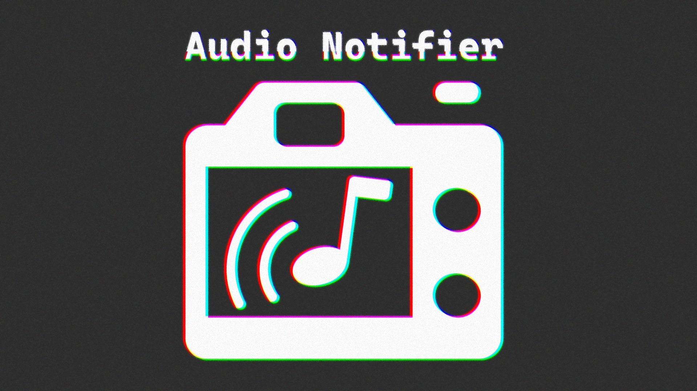
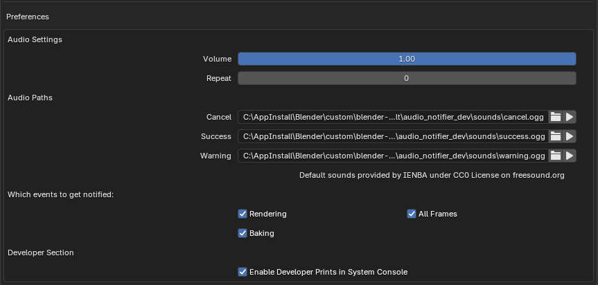

  

-----

- Gives Blender audio notifications for success, cancel and warning events. Shipped with default [sound files](https://freesound.org/s/762132/) under [CC 0](http://creativecommons.org/publicdomain/zero/1.0/) license. Credits to [IENBA](https://freesound.org/people/IENBA/).
- Out of the box notifies of the success or cancellation of renders and baking processes.

## Usage

In the addon's preferences, you can specify a custom sound file for each notification.  
Pressing [[&#10229; Backspace]] while hovering a path or using [[Right 🖱️]] > Reset To Default Value will reset it to using the default sound file provided with the addon.  
You can also toggle on/off the render and baking events notifications if you don't want one of them to occur.
