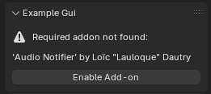

[](https://github.com/L0Lock/AudioNotifier/blob/master/LICENSE)  [](https://ko-fi.com/lauloque)

-----


- Gives Blender audio notifications for success, cancel and warning events. Shipped with default [sound files](https://freesound.org/s/762132/) under [Creative Commons 0](http://creativecommons.org/publicdomain/zero/1.0/) license. Credits to [IENBA](https://freesound.org/people/IENBA/).
- Out of the box notifies of the success or cancellation of renders and baking processes.
- Provides a unified operator reusable for other addons developers to send audio notifications.

## Usage


In the addon's preferences, you can specify a custom sound file for each notification. You can also toggle on/off the render and baking events notifications.


-----

## Use in your addon

### Check before calling

Before calling the operator, it is safer to first check whether  the Audio Notifier extension is enabled to avoid errors:

```python
if context.preferences.addons.find("bl_ext.extensions.audio_notifier") == -1:
    # addon not found
else:
    # you can run the operator
```

You can also propose enabling it if you have a GUI, similar to what I did in my other addon [convertRotationMode](https://github.com/L0Lock/convertRotationMode/tree/main?tab=readme-ov-file#not-so-simple-method) (feel free to dig the source code to see how it is implemented in the [AddonPreferences](https://github.com/L0Lock/convertRotationMode/blob/main/convert_Rotation_Mode/preferences.py)).

```python
def draw(self, context):
    layout = self.layout
    if context.preferences.addons.find("bl_ext.extensions.audio_notifier") == -1:
        # propose enabling the addon
        layout.label(text="Required addon not found:", icon="ERROR")
        layout.label(text="'Audio Notifier' by Loïc \"Lauloque\" Dautry")
        layout.operator("preferences.addon_enable").module="bl_ext.extensions.audio_notifier"

    else:
        # your code that needs to play sound
        layout.label(text="Audio Notifier found")
        layout.operator("preferences.addon_disable").module="bl_ext.extensions.audio_notifier"
```

Example Gui:



### The operator

Call the operator `bpy.ops.audio_notifier.play_sound()` with the sound_type parameter:

- `sound_type` (string) – Specifies which sound to play. Can be one of the following:
  - `"cancel"` – Plays the cancel sound.
  - `"success"` – Plays the success sound.
  - `"warning"` – Plays the warning sound.

More sound types might come in the future.

### **Example Usage:**

To play a "success" sound after an event:

```python
# Call the operator with the 'success' sound type
bpy.ops.audio_notifier.play_sound(sound_type="success")
```